**Lab 1 (15 min)**

In this lab you will set up and configure your personal JFrog Platform
environment.

Your personal Environment will be used for the other labs in the
workshop.

*Your environment will be available for 2 weeks!*

Upon successful completion of this lab you will be able to login to your
personal environment with your personal credentials and observe two
docker repositories configured for you. You will also be able to browse
demo data and findings in the platform

**Step by step instructions**

1.  Open your terminal & download the zip file

> curl -sLO
> [[https://releases.jfrog.io/artifactory/website/security/guided-trial.zip]{.underline}](https://releases.jfrog.io/artifactory/website/security/guided-trial.zip)

2.  Unzip it to your selected working folder

3.  Browse to
    > [[jfrog.com/start-free/security]{.underline}](https://jfrog.com/start-free/security/)

4.  Complete the registration process:\
    > \
    > *[Phase #1:]{.underline}*\
    > 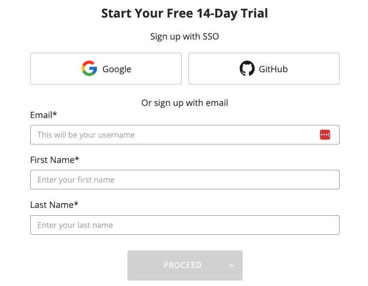{width="6.5in"
    > height="5.055555555555555in"}

> *Phase #2*

-   Populate hostname which you should use later on. Best practice is
    > "firstname-lastname" i.e. "david-cohen"

-   Your company name

-   Select AWS & "EU West" region (Ireland)

> 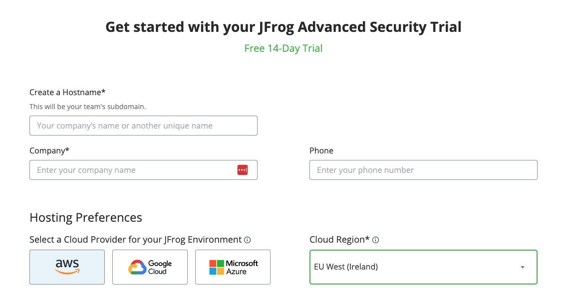{width="6.5in" height="3.25in"}\
> \
> *Phase #3:*
>
> Your environment is being prepared.
>
> In the next screen, please select the password to be used (or API
> token in case of SSO)

5.  Return to your terminal and run
    > bash guided-trial/linux_guided_trial.sh\
    > *There is also a windows version in the folder if needed.*

6.  From the menu, select option #1:
    > Configure the instance new or existing\
    > 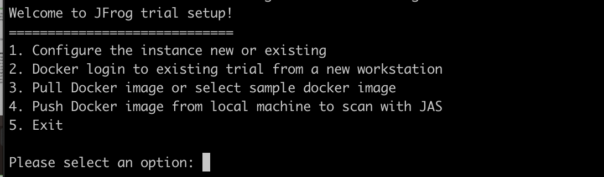{width="6.5in"
    > height="1.9166666666666667in"}\
    > \
    > And then option #2\
    > I already have an instance\
    > 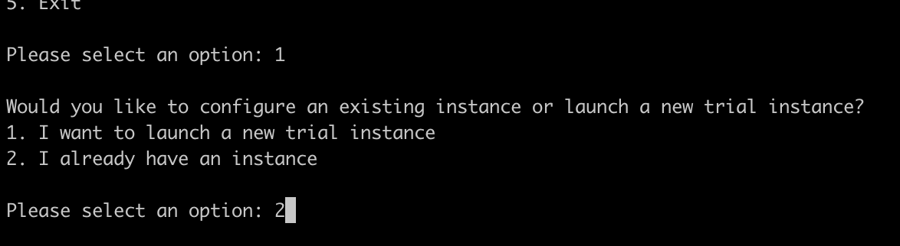{width="6.5in"
    > height="1.7777777777777777in"}\
    > \
    > Now, enter your instance name, email address used & password or
    > token as needed\
    > 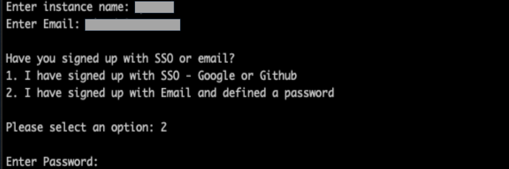{width="6.5in"
    > height="2.1666666666666665in"}\
    > Note the script's outputs as it configures your environment:\
    > 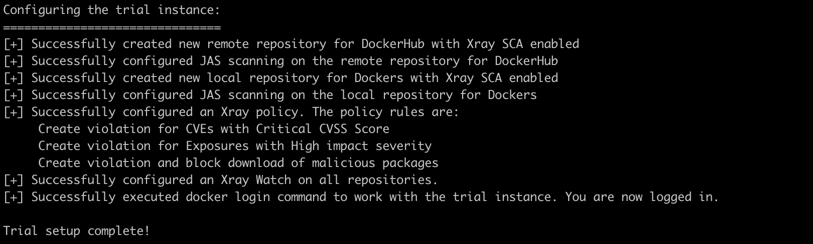{width="6.5in"
    > height="1.9583333333333333in"}

7.  Return to your browser and open your server at https://\<your
    > instance name\>.jfrog.io/ui/admin/repositories/remote and see
    > there is a "docker-hub-remote-repo" remote repository created:\
    > 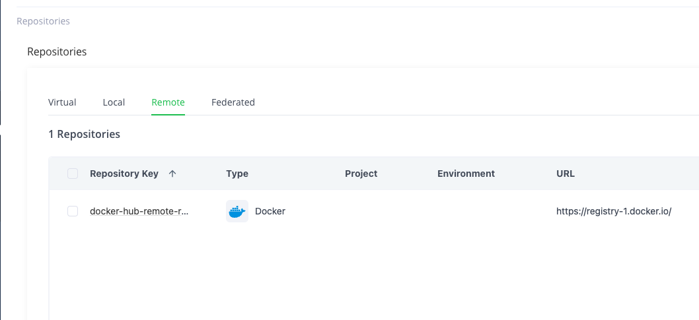{width="6.5in"
    > height="2.986111111111111in"}\
    > Your remote repository will be used in the next lab to pull a
    > docker image from Docker-Hub.

8.  Now, switch to the 'local' tab using the UI or https://\<your
    > instance name\>.jfrog.io/ui/admin/repositories/local to see the
    > "local-docker-repo" local repository created:\
    > 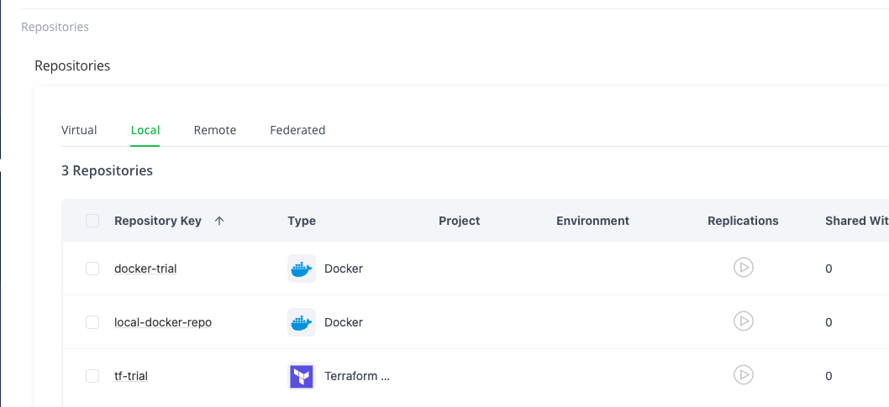{width="6.5in"
    > height="2.986111111111111in"}\
    > Your local repository will be used in the next lab to push a
    > docker image to the JFrog Platform.\
    > \
    > Note the other two local repositories: docker-trial and tf-trial.
    > Those are already pre-populated with Docker and Terraform data &
    > can be browsed during or after the workshop.

> **Congratulations! You have completed Lab 1**

**Lab 2 (30 min)**{width="6.5in"
height="6.944444444444445e-2in"}

In this lab you will experience JFrog Advanced Security value with
actual docker images scanning.

Upon successful completion of this lab you will gain knowledge of how to
use the Security issues page and extract relevant value from it

[**Step by step instructions\
\
***Phase #1 - Pulling a docker image:*]{.underline}

1.  Open the terminal used in Lab 1, or, in case you've closed it, open
    > a new one and run:\
    > bash guided-trial/linux_guided_trial.sh

2.  From the menu, select option #3:

> Pull Docker image or select sample docker image\
> 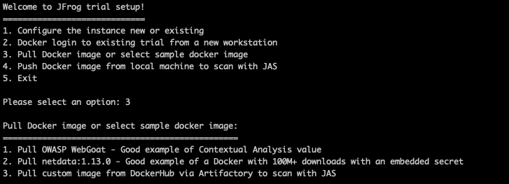{width="6.5in" height="2.3472222222222223in"}

3.  Now select 'WebGoat', option #1:

> Pull OWASP WebGoat - Good example of Contextual Analysis value\
> 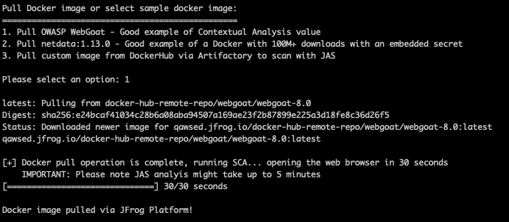{width="6.5in" height="2.8472222222222223in"}\
> Note how the docker image is being pulled from Docker Hub, through
> Artifactory to your personal laptop.
>
> Your browser will be opened to your server's scan results page
> (results may take up to 5 min to complete).

4.  Look at "CVE-2022-22965"

    a.  Is it applicable to this docker image?

    b.  What is the risk?

    c.  What is the remediation process?

5.  Now look at "CVE-2023-20873"

    a.  Note the CVSS score of 9.8!

    b.  Why is it not applicable to this docker image?

*[Phase #2 - Pushing a docker image:]{.underline}*

6.  Go back to your terminal & select option #4 from the menu:

> Push Docker image from local machine to scan with JAS\
> 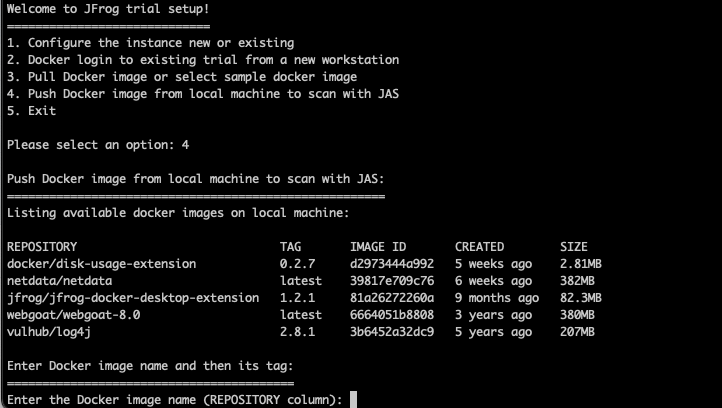{width="6.5in" height="3.6666666666666665in"}
>
> Select a docker image from the list of available images on your laptop
> and push it.
>
> See how the image is uploaded to Artifactory.\
> \
> *[Note]{.underline}: If you do not have one in your workstation, run
> in your terminal: "* docker pull netdata/netdata:v1.13.0*"\
> *The examples below are using the public netdata image.*\
> *\
> Your browser will be opened to your server's scan results page
> (results may take up to 5 min to complete).
>
> 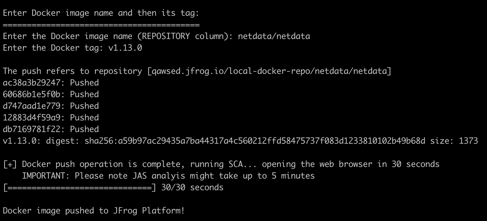{width="6.5in" height="2.9583333333333335in"}

7.  How many CVEs can be found in your selected docker images?

8.  Do you see any High/Critical CVEs that are not applicable? Why?

9.  Does your selected image have any Policy violations?\
    > 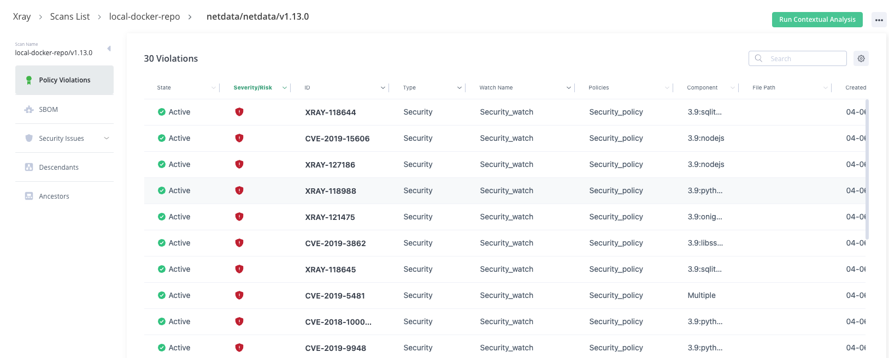{width="6.5in" height="2.625in"}

10. Does your selected image have any application exposures?\
    > 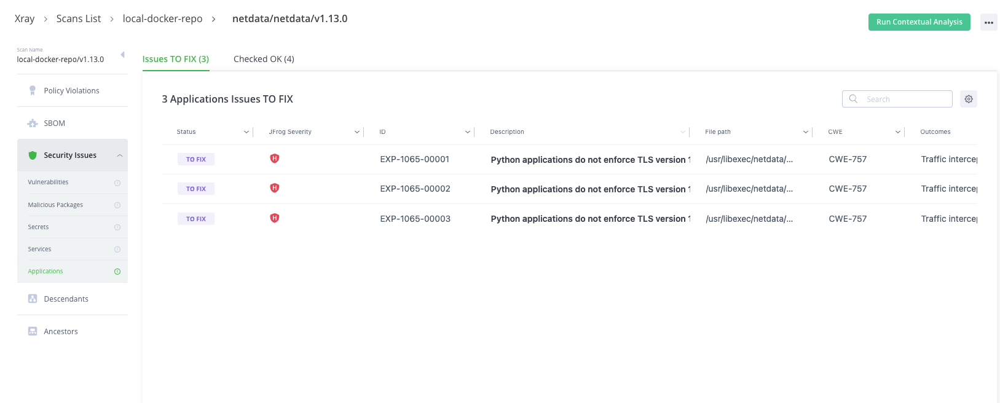{width="6.5in" height="2.625in"}

11. Does your selected image have any secrets detected?\
    > 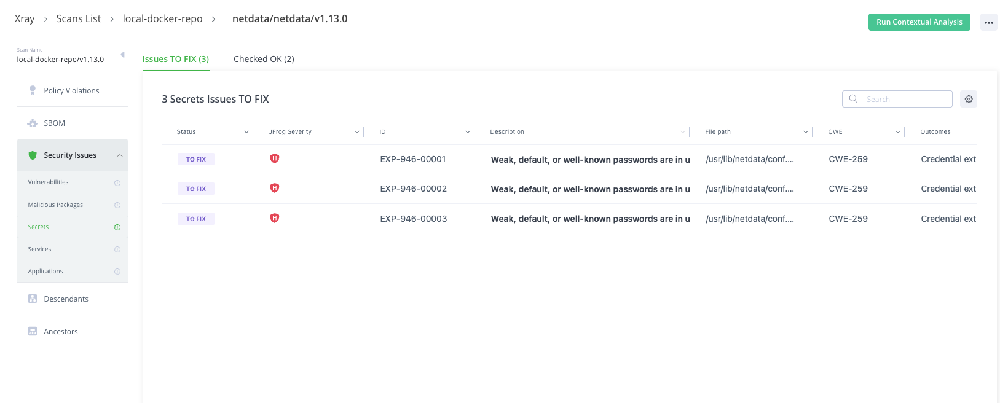{width="6.5in" height="2.625in"}

**[\
Congratulations! You have completed Lab 2]{.underline}**

*[Phase #3 - Advanced]{.underline}*

12. Browse through the PDF in your guided trial folder and
    > read/experiment with the system other capabilities and features

13. Push additional popular docker hub images to view the results

    a.  mvila/npm-addict:production - This image has a malicious
        > package.

    b.  bkimminich/juice-shop - This has Application and Secret
        > Exposures.

    c.  nginxdemos/hello:latest - This has Service Exposures (nginx)

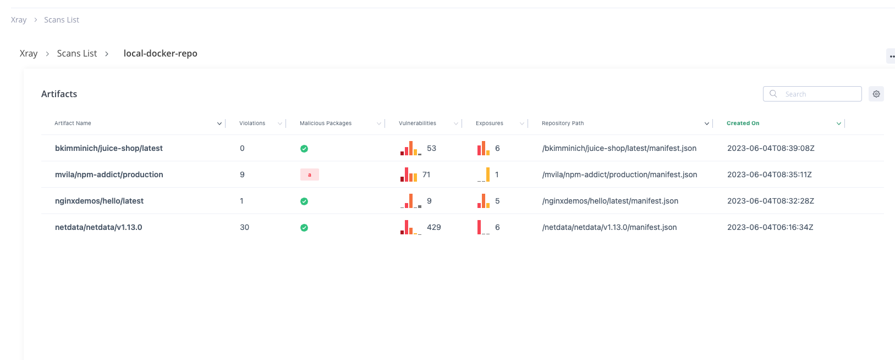{width="6.5in" height="2.625in"}

> OLD

~~**[Prerequisites]{.underline}** are a Mac/Windows/Linux workstation
with:~~

-   ~~'curl' command~~

-   ~~docker client installed & running~~

-   ~~Docker image(s) on your local machine\
    > ~~

**~~[Step 1 - Set up and configure a JAS trial instance]{.underline}~~**

1.  ~~Launch a JAS trial instance using the script & instructions
    > detailed in:
    > [[https://jfrog.com/start-free/security/]{.underline}](https://jfrog.com/start-free/security/)~~

**~~[Step 1 - Set up and configure a JAS trial instance]{.underline}~~**

~~**Run the script option (*1. Launch and configure a new trial*)** and
follow the prompt instructions.~~

~~Follow the prompt messages in the console:~~

1.  ~~Launch a JAS trial instance with your Jfrog/Gmail email address.~~

2.  ~~A local docker repository is created with JAS configured~~

3.  ~~A remote docker repository is created with JAS configured~~

4.  ~~A security policy is created in Xray, the policy is set to create
    > a violation upon critical CVEs and High Exposures~~

5.  ~~A watch is created in Xray, and applies to your docker
    > repositories~~

**~~[Step 2 - Scan DockerHub docker images and answer security
questions]{.underline}~~**

~~**Run the script option (*3. Pull Docker image or select sample docker
image*)**.~~

1.  ~~Scan the 2 Appendix A dockers with JAS~~

2.  ~~Answer the following security questions~~

    a.  ~~What is the Contextual Analysis scan result of
        > "CVE-2019-20367" in the "Webgoat" docker?~~

    b.  ~~Give 1 example of a secret found in "netdata" Docker?~~

**~~[Step 3 - Scan a local docker image from your
workstation]{.underline}~~**

**~~Run the script option (*4. Push Docker image from local machine to
scan with JAS*)~~**

1.  ~~Push a docker image (of your choice) from your local workstation
    > to the local docker repository.~~

> ~~[Note]{.underline}: If you do not have one in your workstation, run
> in your terminal: "docker pull alpine"~~

2.  ~~Review the JAS scans results and see if there were any JAS
    > findings or applicable/non-applicable CVEs. If no JAS findings are
    > found, report how many CVEs were found in the image.~~

**~~[Congratulations!]{.underline}~~**

~~**You have successfully completed the JFrog Security quick trial!**~~

~~The Trial Environment will be kept available for you in the coming two
weeks.~~

~~Feel free to further experiment with it and reach out to us for
further questions and discussions with our Security and DevOps
experts.~~

**~~[Appendix A - List of sample dockers from
DockerHub:]{.underline}~~**

-   ~~webgoat/webgoat-8.0:latest~~

-   ~~netdata/netdata:v1.33.1~~

**~~[Appendix B - Download-able Trial Zip with Script & detailed
screenshots]{.underline}~~**

-   ~~[[https://releases.jfrog.io/artifactory/website/security/guided-trial.zip]{.underline}](https://releases.jfrog.io/artifactory/website/security/guided-trial.zip)~~
